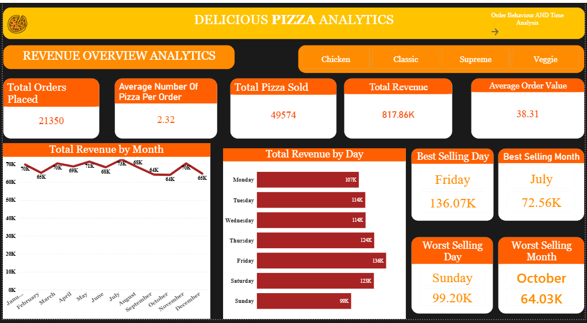
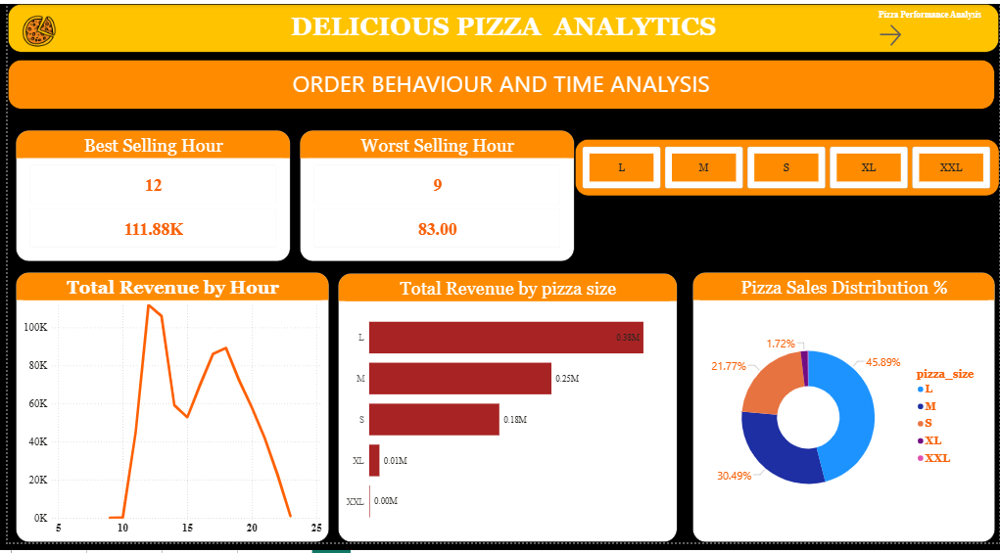
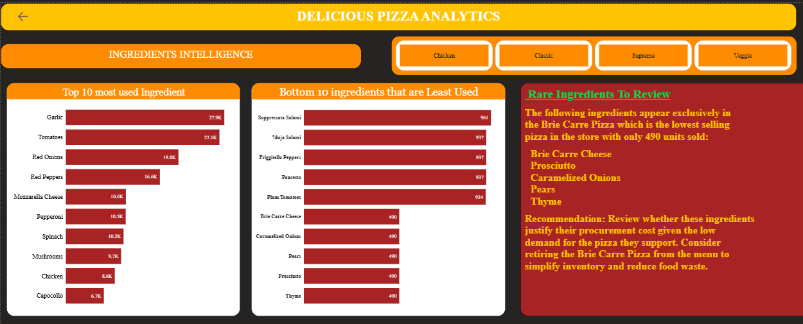

# 🍕 Delicious Pizza Analytics

## Project Overview
A full end to end data analytics project analyzing 
one full year of pizza sales data for Delicious Pizza Co.
The project covers SQL data extraction, business insight 
generation and interactive dashboard creation.

## Tools Used
- MySQL — Data querying and analysis
- Power BI — Interactive 4 page dashboard
- PowerPoint — Business presentation
- Git — Version control

## Business Questions Answered
1. What is the total revenue and average order value?
2. Which month and day generate the most revenue?
3. During which hour are the most orders placed?
4. Which pizzas sell the most by quantity and revenue?
5. Which pizza category and size dominates sales?
6. What ingredients are used most and least?
7. Which pizzas should be retired from the menu?

## Key Findings
- Total Revenue: $817,860.05
- Total Orders: 21,350
- Average Order Value: $38.31
- Best Month: July at $72,557.90
- Worst Month: October at $64,027.60
- Best Selling Day: Friday at $136,073.90
- Peak Hour: 12 Noon at $111,877.90
- Most Sold Pizza: Classic Deluxe at 2,453 units
- Highest Revenue Pizza: Thai Chicken at $43,434.25
- Most Used Ingredient: Garlic at 27,913 weighted uses
- Least Used Ingredient: Thyme at 490 weighted uses

## Dashboard Pages
- Page 1 — Revenue Overview
- Page 2 — Order Behaviour and Time Analysis
- Page 3 — Pizza Performance
- Page 4 — Ingredients Intelligence

## Project Files
| File | Description |
|------|-------------|
| Delicious_Pizza_Analytics.sql | All MySQL queries |
| Delicious_Pizza_Analytics.pbix | Power BI dashboard |
| Delicious_Pizza CO.Analytics Report.pptx | Presentation |
| Sampledata.csv | Raw dataset |

## Dashboard Preview

### Page 1 — Revenue Overview

### Page 2 — Order Behaviour

### Page 3 — Pizza Performance

### Page 4 — Ingredients Intelligence

## Author
Beatrice Wambui
www.linkedin.com/in/beatrice-wakonyo-tech

